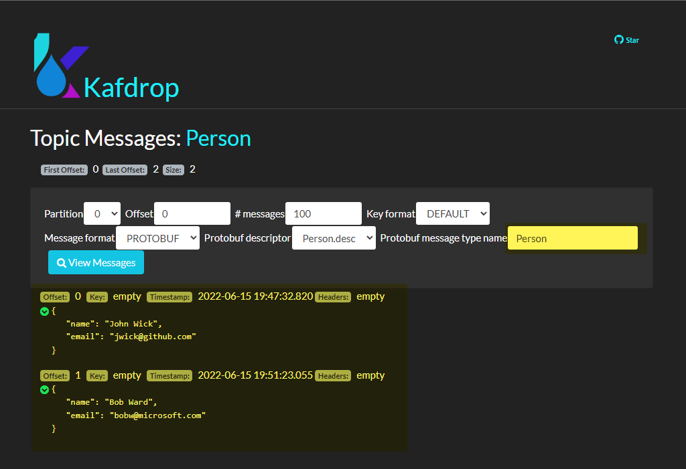

# Kafdrop Protobuf Hello-world

## Building the proto descriptor file

Build the descriptor file. For example using the proto from this repo:
```shell
cd /workspaces/otel-hackathon/Arc-otel-experiment/demo_proto
protoc -o Person.desc Person.proto
```
## Create configMap and redeploy Kafdrop

```bash
# Create ConfigMap
kubectl create configmap kafdrop-proto-config -n laas \
        --from-file=Person.desc

# Redeploy
cat <<EOF | kubectl apply -f -
kind: Deployment
apiVersion: apps/v1
metadata:
  name: kafdrop-1
  namespace: laas
spec:
  selector:
    matchLabels:
      app: kafdrop
  template:
    metadata:
      labels:
        app: kafdrop
    spec:
      containers:
        - name: kafdrop
          image: obsidiandynamics/kafdrop:latest
          volumeMounts:
          - name: kafdrop-proto-config-vol
            mountPath: /var/protobuf_desc
          ports:
            - containerPort: 9000
          env:
            - name: KAFKA_BROKERCONNECT
              value: "kafka-service:9092"
            - name: KUBERNETES_HOST_IP
              valueFrom:
                fieldRef:
                  apiVersion: v1
                  fieldPath: status.hostIP
            - name: KUBERNETES_NODE_NAME
              valueFrom:
                fieldRef:
                  apiVersion: v1
                  fieldPath: spec.nodeName
            - name: CMD_ARGS
              value: "--message.format=PROTOBUF --protobufdesc.directory=/var/protobuf_desc"
      volumes:
        - configMap:
            name: kafdrop-proto-config
            items:
              - key: Person.desc
                path: Person.desc
          name: kafdrop-proto-config-vol
EOF
```

## Create topic and send data

```bash
export kafka_pip=$(kubectl get svc kafka-service -n laas -o json | jq -r .status.loadBalancer.ingress[0].ip)

cat John.person \
| protoc --encode=Person Person.proto \
| kafkacat -b $kafka_pip:9092 -t Person -D ""

cat Bob.person \
| protoc --encode=Person Person.proto \
| kafkacat -b $kafka_pip:9092 -t Person -D ""
```

We see:
